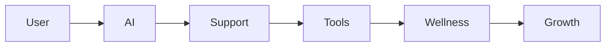
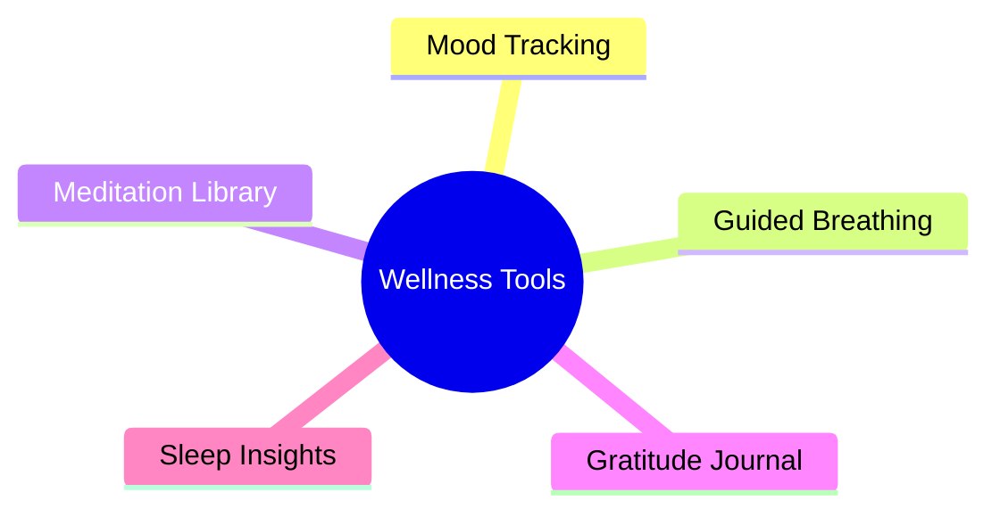
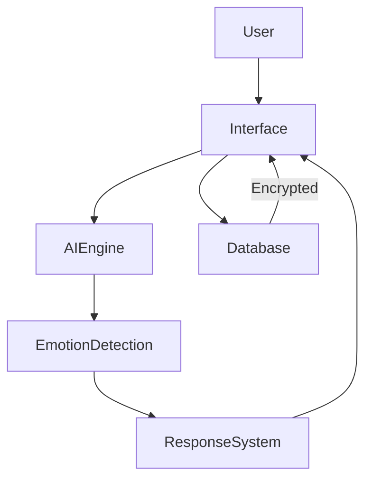
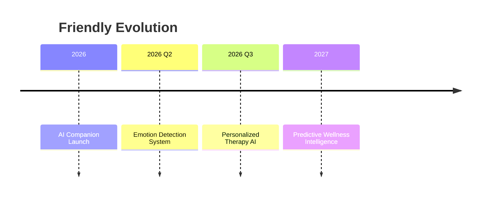

<h1 align="center">💜 Friendly — Privacy-First Mental Wellness Companion</h1>

<p align="center">

</p>

<p align="center">


</p>

---

<p align="center">
🌐 <b>Live Demo</b> • 📚 <b>Documentation</b> • 🐛 <b>Report Issues</b> • 💬 <b>Support</b>
</p>

---

## 🧠 About Friendly

> Built for students. Designed for wellness. Powered by AI. Protected by privacy.

**Friendly** is a privacy-first AI mental wellness companion that helps students detect stress early, prevent burnout, and maintain emotional balance through supportive conversations, wellness tools, and relaxing experiences — all with zero data sharing.

---

## 📊 Platform Stats

| Metric | Value |
|------|------|
| 🧠 Students Supported | **10K+** |
| 🔐 Privacy Guarantee | **100% Secure** |
| 🤖 AI Conversations | **500K+** |
| ⚡ Response Time | **<100ms** |
| 📶 Uptime | **99.9%** |
| 💾 Data Shared | **0** |

---

## 🎯 Core Promises

```
🔐 Private by Design
🤖 Emotionally Intelligent AI
⚡ Instant Support
✅ Zero Data Tracking
```

---

## 🌟 System Overview



---

## 🤖 AI Companion

<details>
<summary>View AI Capabilities</summary>

- 🧠 Empathetic conversations  
- 🆘 Crisis detection + emergency help  
- 💭 Conversation memory  
- 🎯 Personalized advice  
- 🔒 Fully confidential  

</details>

---

## 🛠 Wellness Toolkit



| Tool | Benefit | Time |
|------|--------|------|
📊 Mood Tracker | Emotional insights | 2 min |
🧘 Breathing | Reduce anxiety | 3–5 min |
🎵 Meditation | Sleep + focus | 5–30 min |
✍️ Journal | Boost positivity | 5 min |
😴 Sleep Tips | Personalized advice | 3 min |

---

## 🎮 Relax & Recharge

<details>
<summary>Fun Zone Features</summary>

🎰 Mini Games  
📖 Interactive Stories  
😄 Comedy Clips  
🎵 Relaxing Music  
💖 Daily Affirmations  
🎨 Creative AI Activities  

</details>

---

## ⚙️ Architecture Flow



---

## 🧭 Philosophy

```
Support > Judgment
Progress > Pressure
Healing > Hustle
```

---

## 🚀 Product Roadmap



---

## 🧩 Tech Stack

<p align="center">


</p>

---

## 🤝 Contributing

```bash
Fork → Improve → Pull Request → Merge 🚀
```

We welcome all contributions that improve mental wellness accessibility 💜

---

## ⭐ Support the Mission

<p align="center">
If Friendly helped you feel better 🌿  
<br><br>
⭐ Star this repository  
<br>
💜 Share with friends  
<br>
🌍 Help more students  
</p>

---

<p align="center">
Made with care for mental wellness 💜
</p>
